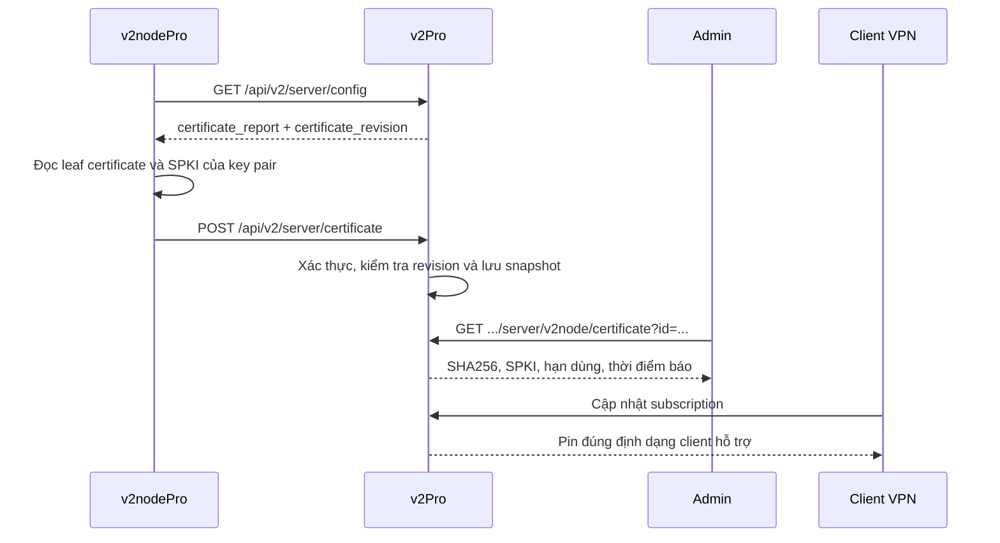

# Vân tay chứng chỉ tự động: zboard → v2Pro + v2nodePro

## Kết quả nghiên cứu

Đối chiếu ngày 06/09/2026 với zboard commit `e689291d7310dfabcc5c5b2a9d9bc36f5d155ad6`,
znode commit `b67d62787ae3d50f59ab6a801dc735f6f901f4b3` và v2nodePro commit
`20b7b31517b9c6f997df8b10b4b7fb3badc5e047`.

Trong zboard, “Vân tay chứng chỉ (tự động)” hiển thị dữ liệu node gửi về.
Đây là pin của chứng chỉ máy chủ. Trường `fingerprint: chrome` trong TLS settings
là cấu hình ClientHello/uTLS, phục vụ mục đích khác.

Luồng zboard đã kiểm tra trong mã nguồn:

1. Node báo `tls_certificate_sha256` (SHA-256 của leaf certificate DER, hex)
   và `tls_public_key_sha256` (SHA-256 của SPKI, Base64), kèm hạn dùng và issuer.
2. `UniProxyController::status` chuẩn hóa báo cáo và lưu `SERVER_ZNODE_CERT_<id>`
   trong cache 30 ngày; báo cáo hợp lệ làm mới thời hạn. Báo cáo thiếu hash giữ
   snapshot tốt gần nhất; tắt TLS xóa snapshot.
3. `ServerService` gắn snapshot vào node khi xuất subscription; bộ xuất của
   từng client chọn loại hash và tên trường phù hợp. Thay đổi pin làm đổi
   revision/cache key liên quan.
4. Nút “Lấy ngay” xếp một `certificate_request` cho agent đã được gán node.
   Agent lấy yêu cầu ở API config và trả kết quả qua
   `/api/v2/server/agent/certificate/report`. Panel kiểm tra mã yêu cầu và
   quyền sở hữu node. Giao diện đợi báo cáo mới tối đa khoảng 60 giây.
5. `cert_mode=auto` dùng DNS/ACME là phần cấp chứng chỉ riêng. Việc tự báo vân
   tay dùng được cả với chứng chỉ tự ký và chứng chỉ cấp bởi CA.

Nguồn trực tiếp:

- [UI NodeEditor](https://github.com/fsh2502/zboard/blob/e689291d7310dfabcc5c5b2a9d9bc36f5d155ad6/frontend/admin-v2/src/components/NodeEditor.jsx)
- [UniProxyController: báo cáo định kỳ](https://github.com/fsh2502/zboard/blob/e689291d7310dfabcc5c5b2a9d9bc36f5d155ad6/app/Http/Controllers/V1/Server/UniProxyController.php)
- [ZnodeAgentService: yêu cầu đọc và nhận chứng chỉ](https://github.com/fsh2502/zboard/blob/e689291d7310dfabcc5c5b2a9d9bc36f5d155ad6/app/Services/ZnodeAgentService.php)
- [ServerService: gắn pin vào subscription](https://github.com/fsh2502/zboard/blob/e689291d7310dfabcc5c5b2a9d9bc36f5d155ad6/app/Services/ServerService.php)
- [README znode](https://github.com/fsh2502/znode/blob/b67d62787ae3d50f59ab6a801dc735f6f901f4b3/README.md): repo phân phối script và binary, runtime chỉ kết nối ZBoard.

Không có mã nguồn runtime ZNode trong repo phân phối để kiểm chứng trực tiếp
cách binary tính hash. Hợp đồng API và hành vi panel ở trên được xác nhận từ
mã nguồn zboard; v2nodePro có mã nguồn để triển khai và kiểm tra phần tính hash.

## Phần đã tích hợp

Giữ v2nodePro theo lựa chọn của chủ repo. Hai phía dùng API xác thực hiện có
của v2Pro (`server_token` dùng chung), không yêu cầu mô hình ZNode Agent.



Panel:

- `NodeCertificateService` chuẩn hóa hai hash, lưu cache 30 ngày và gắn báo
  cáo với revision của cấu hình TLS. Báo cáo từ cấu hình cũ bị từ chối với 409.
- API mới `POST /api/v2/server/certificate` dùng xác thực node hiện có.
  Node cũ tiếp tục dùng API config/traffic bình thường.
- Giao diện **V2node → cấu hình bảo mật/TLS** có ô “Vân tay chứng chỉ (tự động)”,
  nút **Làm mới** và tùy chọn **Ghim chứng chỉ tự động trong subscription**.
  Ô tự lấy snapshot mỗi 15 giây khi mở. Nút làm mới đọc snapshot hiện có;
  báo cáo mới tới theo chu kỳ push của node, mặc định 60 giây. Bản tích hợp
  này không có hàng đợi “Lấy ngay” của ZNode Agent.
- Node con dùng snapshot của node cha. ETag danh sách server thay đổi khi pin
  thay đổi. Subscription được tạo lại từ snapshot hiện hành khi client tải.
- DNS environment và đường dẫn file chứng chỉ/khóa được loại khỏi dữ liệu
  TLS của subscription V2node.

Node v2nodePro:

- Nhận capability trong `base_config`; chỉ bật reporter khi panel hỗ trợ.
- Đọc chứng chỉ bằng thư viện Go, kiểm tra cặp cert/key, tính cả leaf DER hash
  và SPKI hash. Khóa riêng được đọc tại VPS để kiểm tra cặp khóa và không gửi đi.
- Báo ngay sau khi khởi tạo node thành công, sau đó theo chu kỳ push bằng task
  riêng, kể cả khi không có lưu lượng. Lỗi report không dừng task traffic.
- File cert đổi sẽ yêu cầu reload bằng cơ chế hiện có rồi mới báo pin mới.
  Cơ chế reload hiện tại có thể ảnh hưởng các kết nối trên tiến trình node;
  đây không phải cam kết gia hạn không gián đoạn.
- File lỗi hoặc cặp khóa chưa khớp trong lúc gia hạn sẽ giữ báo cáo tốt gần
  nhất. Tắt TLS/REALITY gửi trạng thái disabled để bỏ snapshot TLS thường.

## Định dạng subscription

| Client/bộ xuất | Trường | Dữ liệu |
|---|---|---|
| URI VLESS/VMess/Trojan/AnyTLS dùng Helper, Happ | `pcs`, `vcn`; Happ thêm `pcn` | Certificate SHA256 hex + tên xác thực |
| Hysteria2 URI, Happ HY2 | `pinSHA256` | Certificate SHA256 hex; giữ lựa chọn `insecure` hiện có |
| Clash Meta, Verge, Nyanpasu/Mihomo | `fingerprint`, `name-cert-verify` | Certificate SHA256 hex |
| Stash | `server-cert-fingerprint` | Certificate SHA256 hex |
| sing-box từ 1.13.0, nhận diện bằng User-Agent | `tls.certificate_public_key_sha256` | Mảng SPKI SHA256 Base64 |

REALITY và node không bật TLS thường không nhận certificate pin. Bộ xuất
sing-box cũ hoặc không xác định phiên bản không nhận trường chỉ hỗ trợ từ
1.13.0. Các ứng dụng khác có thể dùng chung URI nhưng vẫn cần phiên bản core
thực sự hỗ trợ pin; không suy ra tương thích chỉ từ tên ứng dụng.

Tài liệu client: [sing-box TLS](https://sing-box.sagernet.org/configuration/shared/tls/),
[Mihomo TLS](https://wiki.metacubex.one/en/config/proxies/tls/),
[Hysteria2 URI](https://v2.hysteria.network/docs/developers/URI-Scheme/).

Với CDN/proxy kết thúc TLS, chứng chỉ client thấy có thể khác chứng chỉ origin.
Khi đó tắt **Ghim chứng chỉ tự động trong subscription** ở node tương ứng.
Sau khi cert đổi, client cần tải lại subscription để nhận pin mới.

## Áp dụng và triển khai

Thay đổi panel nằm trực tiếp trong repo v2Pro này. Thay đổi node nằm trong
checkout `C:/Users/Admin/v2Pro-2-work-node` và được đóng gói trong
[`patches/v2nodePro-certificate-report.patch`](patches/v2nodePro-certificate-report.patch).
Patch dựa trên v2nodePro commit ghi ở đầu tài liệu.

Để áp dụng patch vào một checkout v2nodePro khác:

```sh
git apply --check /path/to/v2Pro/docs/patches/v2nodePro-certificate-report.patch
git apply /path/to/v2Pro/docs/patches/v2nodePro-certificate-report.patch
GOEXPERIMENT=jsonv2 go test ./common/certificate ./api/v2board ./node
GOEXPERIMENT=jsonv2 CGO_ENABLED=0 go build -trimpath -o v2node .
```

1. Triển khai mã panel cùng các asset admin. Chạy `php artisan optimize:clear`
   và khởi động lại tiến trình panel dài hạn nếu đang dùng Webman/Workerman.
   Không có migration DB mới.
2. Build/phát hành binary v2nodePro từ mã đã sửa và cập nhật service `v2node`
   trên VPS bằng quy trình triển khai hiện có. Giữ cấu hình node/API hiện tại.
   Chạy lại installer tải bản release cũ sẽ chưa có tính năng này.
3. Mở một node TLS thường trong admin, chờ báo cáo, đối chiếu SHA256 với cert
   trên VPS, rồi tải subscription bằng client hỗ trợ và thử kết nối.

Đã build thành công binary **Linux amd64** tại
`C:/Users/Admin/v2Pro-2-work-node/dist/v2node-linux-amd64`.
Binary này chưa được chạy trên VPS. Mã chưa được push lên GitHub hoặc triển khai.

## Kiểm tra đã thực hiện

- `php tests/certificate-smoke.php`: 33 kiểm tra hồi quy với cache giả lập,
  gồm chuẩn hóa hash, revision cũ, report lỗi, gia hạn, tắt TLS, pin URI,
  Mihomo/Stash, sing-box theo phiên bản và tùy chọn tắt ghim.
- Kiểm tra cú pháp tất cả file PHP thay đổi và JavaScript admin.
- Go test: tính leaf/SPKI, cert chain, gia hạn giữ cùng khóa, cặp khóa sai,
  HTTP auth/payload/lỗi, vòng đời report, đổi file trước reload, REALITY,
  capability của panel cũ. `go vet` qua các package thay đổi.
- Kiểm tra Browser với component React thật và API dữ liệu giả lập
  (`node tests/certificate-preview.js`): hiển thị hash, thời hạn, làm mới và
  thao tác checkbox.
- Kiểm tra patch node áp dụng ngược khớp checkout đã sửa.

Chưa kiểm tra toàn bộ Laravel với DB/Redis thật, phiên đăng nhập admin thật,
hoặc kết nối VPN trên VPS. Cache giả lập và trang preview là kiểm tra cục bộ,
không thay thế bước thử triển khai ở trên.
